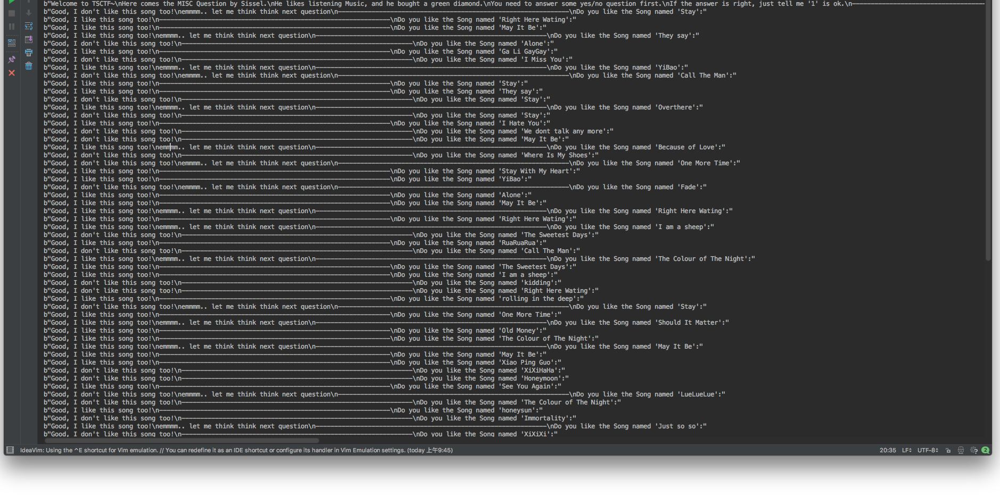
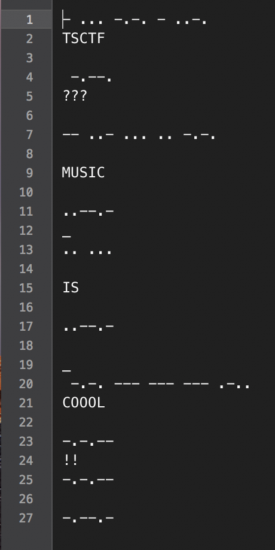
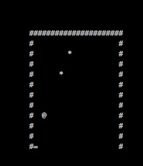
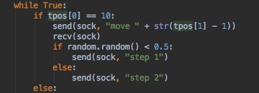
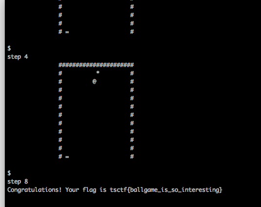
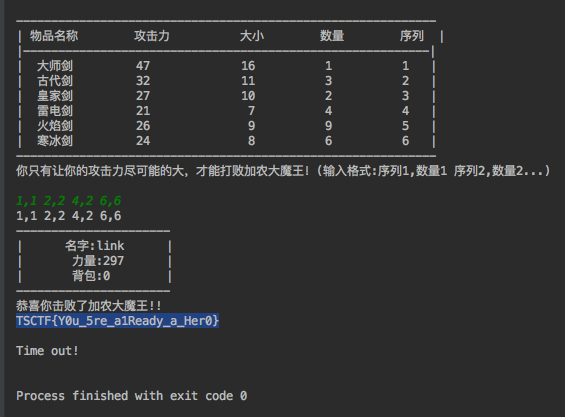
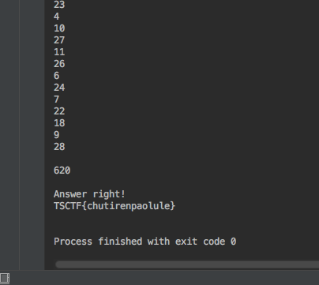

# TSCTF2018 WriteUp by SHawnHardy

## Misc & Crypto

### 我需要治疗

把括号去掉就是base64，解码拿到疑似flag串，然后感觉括号不是大括号，应该不是flag

输了进去发现，果然不对

改成大括号也不对

关注公众号然后把假flag输进去，拿到了真的flag

### 爱听音乐的friends

nc了过去，发现是个coding题

本来想脑子记一下，发现题目太多了

写了python脚本才知道歌曲总数量得有30+了

然后发现了TSCTF{So_Where_is_the_real_flag?}

果然这题不是coding题(这题带给我了不好的引导，影响了后面的Zelda，出题人是真的皮)

联想到要求 ：是的话，扣1

我觉得flag可能是隐藏在答案里，要把答案变成一个01串

在多次得到串后证明了这一点(有坑点，可能要取个反才是真正的串)

试了下摩尔斯电码发现前几段和TSCTF匹配

然后问题来了，没有分隔。

再仔细看过了问题后我发现了如果问题含有emmmm那么就是最后一个bit

在尝试了多个在线转换，没有找到能识别'{'和'_'的，之后

我对照维基百科自己解码得到了flag

##  Web

### are you in class

根据提示，要在post请求的头里加上ip相关的段

发过去就得到了flag

## Coding

### ballgame (代码在附件中)

弹球游戏，step n是让时间流逝n秒，move n是接球板瞬移到n位置。

首先我想到的方法是先step 1判断出球的运动轨迹，然后直接模拟出怎么弹球。

但是这个游戏的弹球判定太迷了，撞击后移动的方向没有个明确的规则。感觉一个个找，再写进去，再debug会累死，所以放弃了预判运动轨迹。

最终的方案是这样，step球的高度-1（避免掉下去），然后判断下一步是否会掉下去，如果会掉下去就把板移动到能接到的地方，然后再step1

这个方法极其看脸。。。超时的概率极高。而我又是一个非酋，所以最开始一直各种剩两三个，甚至还会只剩下一个。

在尝试了不下二十余次后我决定加个优化（雾）

做法是这样：经过分析很多step被浪费在了刚弹出板的那几次，因为球的高度不高，所以step的步数总是很低。于是我加入了一个随机，如果触板，有一半的概率step1，保证极端情况也不会掉下去（刚弹上去就撞下来），另一半概率step2

神奇优化：

再尝试了十几次后终于是出货了

### Zelda (代码在附件中)

过一个迷宫，然后解一个背包

一开始，我写dfs解迷宫算法写残了，导致我以为需要解的迷宫不止一个

写残了的结果就是，第一次跑不到终点，返回的是一个中间态，然后就一直到不了终点，总是timeout

这让我以为是和“爱听音乐的friends”一样，coding壳的misc题，花费了大量时间思考这个迷宫和路径会隐藏什么信息

修正了迷宫程序之后成功的看到了第二个问题，解一个多重背包

在多次测试之后我发现这个题是固定不变的，所以与其写个程序解，不如用眼睛瞪出来

提交答案，flag到手

### PartyOfGodZe (代码在附件中)

在经过漫长的和客服套近乎，向客服诉苦后我终于搞懂了题意。

题意可以转化为：一个无向图，有C个点，R条边。C个点中有一个点是泽神家，有H个点是小伙伴家，有F个点放的是食物。要求出最优方案(路径最短)的路径长度。这个方案是每个小伙伴从家出发到泽神家，同时，每种食物至少要有一个小伙伴拿到。

点数量级不大，使得我们可以用Floyd-Warshall算法处理出任意两点的最短距离。这样的话就可以缩小点的数量，不再关心除了泽神家，小伙伴家，食物以外的点。

求解的过程为暴力枚举方案。

递归的方式构造食物和小伙伴的映射(每种食物只指定一个小伙伴去拿，但一个小伙伴可能被规划要去拿多个食物)，再求当前方案的最小距离。

求方案的最小距离也是暴力枚举方案。

比如说小伙伴A要拿食物B1，B2，B3，最后到泽神家，那么我们就遍历所有B的排列，从而拿到最短距离。

最后成功的通过了这道题。

